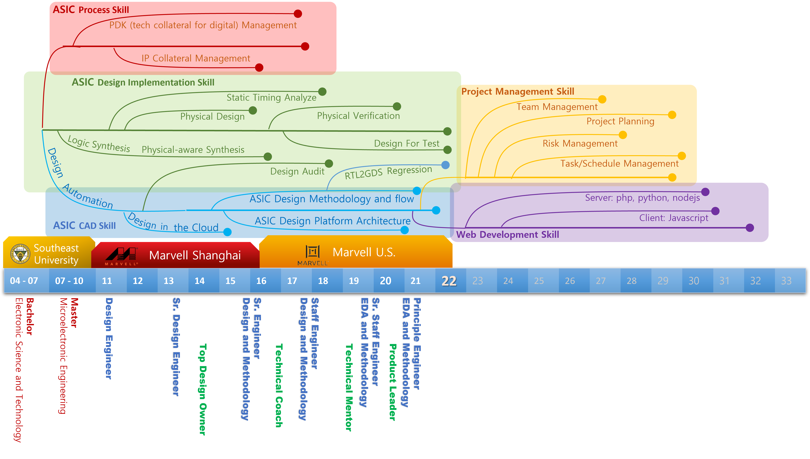

<!--
 * @LastEditors: SteveL
-->
# Know the Career Path

Recently, I checked some of my social media inbox, I find several questions about CAD position in ASIC area.

I can make a face-to-face discussion with the person who asked the question.

But how to do with one article, or just discuss through the email or chat efficiently.

I think this is also a good example for __Data Visualizaiton in ASIC__.

## My Career Tree example

[SRC File: career_tree.pptx](assets/src/career_tree.pptx)
## Audience and Purpose

First let's think about who is the audience of the image, data visualization?

recuiter, new hires, or someone not in ASIC industry?

