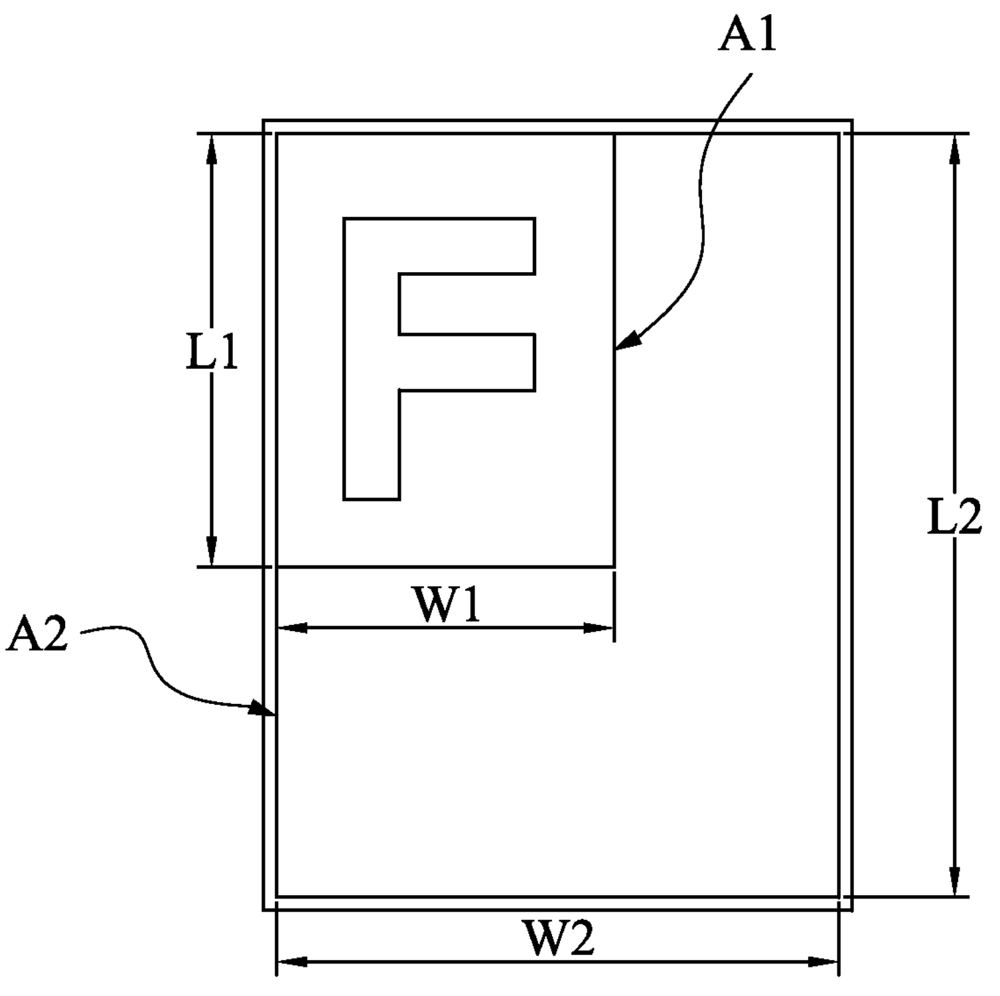

<!--
 * @LastEditors: SteveL
-->
# VLSI MFU Report

MFU=(mask utilized area)/(mask field area), where the mask utilized area is an area of the features (for example, the device pattern) of the reticle to be transferred onto the wafer substrate at one time. In fact, reticles are typically patterned at a large size than the desired wafer pattern size. Reticle magnification factor in use are, for instance, 2×, 2.5×, 4×, 5×, and 10×. The reticle magnification factor is equal to the lens reduction factor in the exposure tool. That is, the device pattern herein is reduced by the magnification factor when imaged onto the wafer substrate.

Herein is an example of MFU calculation. The following figure is a top view of a mask utilized area A1 and a mask field area A2 of the reticle in accordance with various embodiments of the present disclosure. In the image, one of the device design layout form the mask utilized area A1. The orientation of the pattern F herein defines the orientation of the device design layout. L1 and W1 are the length and width of the mask utilized area A1, and L2 and W2 are the length and width of the mask field area A2. The MFU is about 28% when L1=17 cm, W1=15 cm, L2=33 cm, and W2=26 cm. The mask utilized area A1 along vertical and horizontal directions is not greater than the mask field area A2 along the vertical and the horizontal directions, respectively.

## Reference

- https://caly-technologies.com/die-yield-calculator/
- https://anysilicon.com/die-per-wafer-formula-free-calculators/
- https://view.officeapps.live.com/op/view.aspx?src=https%3A%2F%2Ff01.justanswer.com%2FdtbBomJy%2FJust_answer_MPL_work_for_MLM_n_MFU___12_11_2020.xlsx&wdOrigin=BROWSELINK
- https://www.patentsencyclopedia.com/app/20120046775
