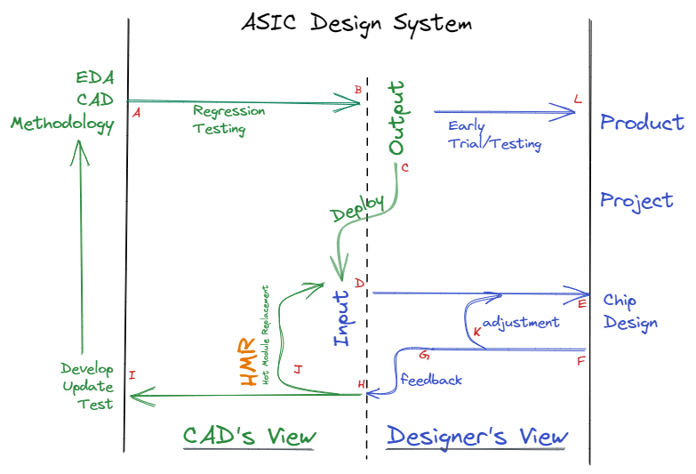

# Hot Module Replacement

([SRC File: hot_module_replacement.excalidraw](assets/src/hot_module_replacement.excalidraw))

HMR is highlighted with a different "color temperature" and you should recognize it right away. And it stands for "Hot Module Replacement".

- "Module" could be a function, a component, a step, or just a command.
- In the ASIC design system, we need a quick turnaround for certain issues. I am more supportive of the "ECO" approach rather than running from the start every time. So Hotfix (online fix) is very important for the system.
- "Audience and Purpose": The user of ASIC design system is the experts in ASIC and the goal is to empower their ability, not let them follow certain CAD frameworks.
- You may argue, that is too complicated. "It depends". For a 10 people team, the D->E->F->K loop may be good enough, for a 30 people team, L->C->D->E->F->K may be OK, but for 50 and more team members, I recommend the whole system.
